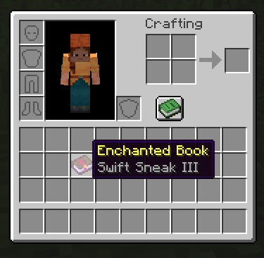
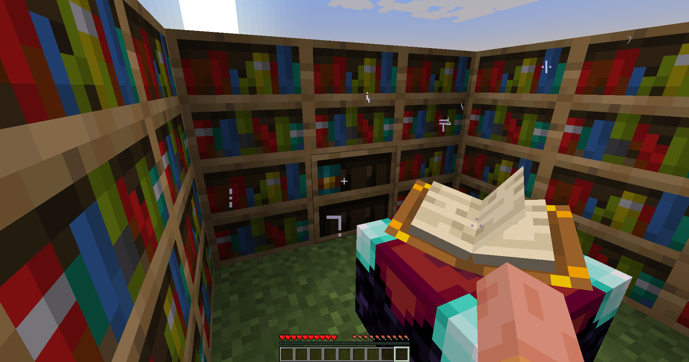
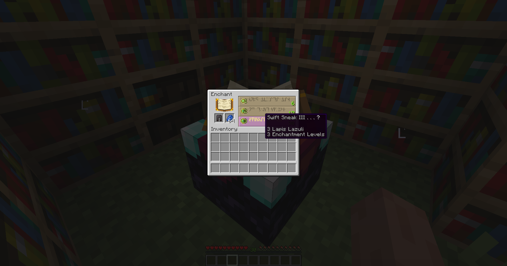

This mod allows you to use enchanted books in chiseled bookshelves around an enchanting table to make that enchanting table inherit the books' enchantments.

This allows you to get Swift Sneak, Mending, Wind Burst, and Soul Speed from an enchanting table without having to loot dozens of structures multiple times or, for Mending, buy it from villagers.

You still need to find the structures to get the book for the chiseled bookshelf, but once you get it, you have already explored the structure, so you have the right to enchant as many items as you want with it. It is like armor trims, but for enchantments.

## Example
Let's say you have a Swift Sneak III book which you got after raiding an ancient city:

You want to enchant two leggings: one without Thorns and one with Thorns. But you only have one book, so normally, you would have to find another ancient city to get the book again. You have already been through the adventure once, so there will be nothing new the second time around. With this mod, you can just place it in a chiseled bookshelf near the enchanting table:

After you have added it to the chiseled bookshelf, it may come in the enchanting table if the item accepts it:

As you can see, I got Swift Sneak III. This is not a guarantee (and the probability is configurable based on the amount of books).

The maximum level you can get is the maximum level of the books you placed for that enchantment.

### Normal bookshelves
Note that you still need normal bookshelves, since chiseled bookshelves provide no power. You can change this by adding the chiseled bookshelf to the tag `#minecraft:enchantment_power_provider`. If you do that, you can also configure the amount of books necessary to provide power in the config file located at `config/chiseledenchanting.json5` in your `.minecraft` folder (or your server's root directory).

## For developers: configuration options
| Option                        | Values                             | Description                                                                                                                                                          | Default value |
|-------------------------------|------------------------------------|----------------------------------------------------------------------------------------------------------------------------------------------------------------------|---------------|
| `allowBookEnchanting`         | `(true\|false)`                    | Defines if books can copy enchantments from the chiseled bookshelves.                                                                                                | `true`        |
| `probabilityType`             | `(LINEAR\|EXPONENTIAL\|QUADRATIC)` | Defines the probability function for each subsequent book.                                                                                                           | `EXPONENTIAL` |
| `firstBookProbability`        | `float`: `0.0f` to `1.0f`          | Defines the individual probability of getting an enchantment for the first book.                                                                                     | `0.25f`       |
| `tenthBookProbability`        | `float`: `0.0f` to `1.0f`          | Defines the individual probability of getting an enchantment for the tenth book.                                                                                     | `0.01f`       |
| `booksNecessaryForPower`      | `int`: `0` to `6`                  | Defines the amount of books necessary to provide power to the enchanting table if chiseled bookshelves are in the `#minecraft:enchantment_power_provider` block tag. | `0`           |
| `substituteEnchantmentChance` | `float`: `0.0f` to `1.0f`          | Defines the probability of enchantments being substituted by the chiseled bookshelves' enchantments rather than added on top.                                        | `0.0f`        |
